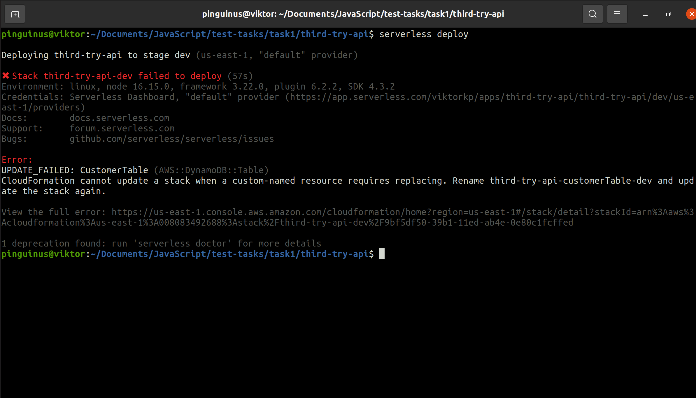

serverless_sdk/index.js
24
let n;e.exports="function"==typeof queueMicrotask?queueMicrotask.bind("undefined"!=typeof window?win
^ TypeError e is not a function
/var/runtime/Runtime.js
73
let result = this.handler(

serverless deploy

Deploying third-try-api to stage dev (us-east-1, "default" provider)

✖ Stack third-try-api-dev failed to deploy (54s)
Environment: linux, node 16.15.0, framework 3.22.0, plugin 6.2.2, SDK 4.3.2
Credentials: Serverless Dashboard, "default" provider (https://app.serverless.com/viktorkp/apps/third-try-api/third-try-api/dev/us-east-1/providers)
Docs: docs.serverless.com
Support: forum.serverless.com
Bugs: github.com/serverless/serverless/issues

Error:
UPDATE_FAILED: CustomerTable (AWS::DynamoDB::Table)
CloudFormation cannot update a stack when a custom-named resource requires replacing. Rename third-try-api-customerTable-dev and update the stack again.

View the full error: https://us-east-1.console.aws.amazon.com/cloudformation/home?region=us-east-1#/stack/detail?stackId=arn%3Aaws%3Acloudformation%3Aus-east-1%3A008083492688%3Astack%2Fthird-try-api-dev%2F9bf5df50-39b1-11ed-ab4e-0e80c1fcffed

1 deprecation found: run 'serverless doctor' for more details
