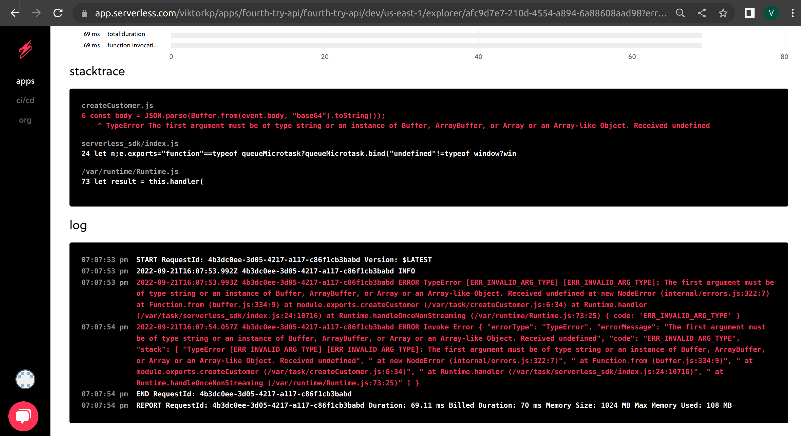

stacktrace
createCustomer.js
6
const body = JSON.parse(Buffer.from(event.body, "base64").toString());
^ TypeError The first argument must be of type string or an instance of Buffer, ArrayBuffer, or Array or an Array-like Object. Received undefined
serverless_sdk/index.js
24
let n;e.exports="function"==typeof queueMicrotask?queueMicrotask.bind("undefined"!=typeof window?win
/var/runtime/Runtime.js
73
let result = this.handler(
log
07:07:53 pm
START RequestId: 4b3dc0ee-3d05-4217-a117-c86f1cb3babd Version: $LATEST
07:07:53 pm
2022-09-21T16:07:53.992Z 4b3dc0ee-3d05-4217-a117-c86f1cb3babd INFO
07:07:53 pm
2022-09-21T16:07:53.993Z 4b3dc0ee-3d05-4217-a117-c86f1cb3babd ERROR TypeError [ERR_INVALID_ARG_TYPE] [ERR_INVALID_ARG_TYPE]: The first argument must be of type string or an instance of Buffer, ArrayBuffer, or Array or an Array-like Object. Received undefined at new NodeError (internal/errors.js:322:7) at Function.from (buffer.js:334:9) at module.exports.createCustomer (/var/task/createCustomer.js:6:34) at Runtime.handler (/var/task/serverless_sdk/index.js:24:10716) at Runtime.handleOnceNonStreaming (/var/runtime/Runtime.js:73:25) { code: 'ERR_INVALID_ARG_TYPE' }
07:07:54 pm
2022-09-21T16:07:54.057Z 4b3dc0ee-3d05-4217-a117-c86f1cb3babd ERROR Invoke Error { "errorType": "TypeError", "errorMessage": "The first argument must be of type string or an instance of Buffer, ArrayBuffer, or Array or an Array-like Object. Received undefined", "code": "ERR_INVALID_ARG_TYPE", "stack": [ "TypeError [ERR_INVALID_ARG_TYPE] [ERR_INVALID_ARG_TYPE]: The first argument must be of type string or an instance of Buffer, ArrayBuffer, or Array or an Array-like Object. Received undefined", " at new NodeError (internal/errors.js:322:7)", " at Function.from (buffer.js:334:9)", " at module.exports.createCustomer (/var/task/createCustomer.js:6:34)", " at Runtime.handler (/var/task/serverless_sdk/index.js:24:10716)", " at Runtime.handleOnceNonStreaming (/var/runtime/Runtime.js:73:25)" ] }
07:07:54 pm
END RequestId: 4b3dc0ee-3d05-4217-a117-c86f1cb3babd
07:07:54 pm
REPORT RequestId: 4b3dc0ee-3d05-4217-a117-c86f1cb3babd Duration: 69.11 ms Billed Duration: 70 ms Memory Size: 1024 MB Max Memory Used: 108 MB
